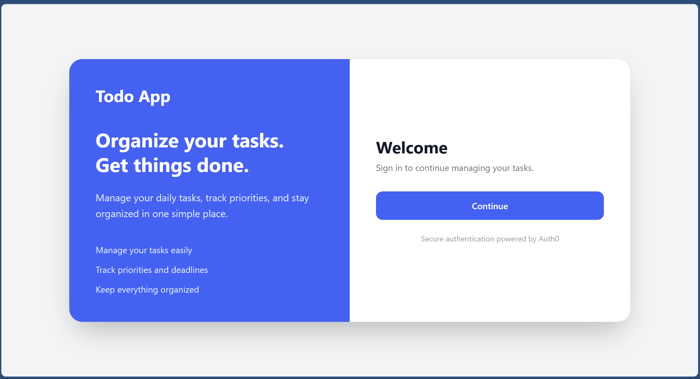
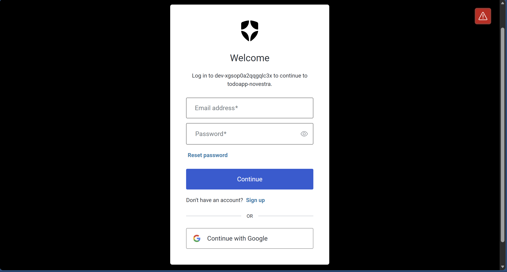
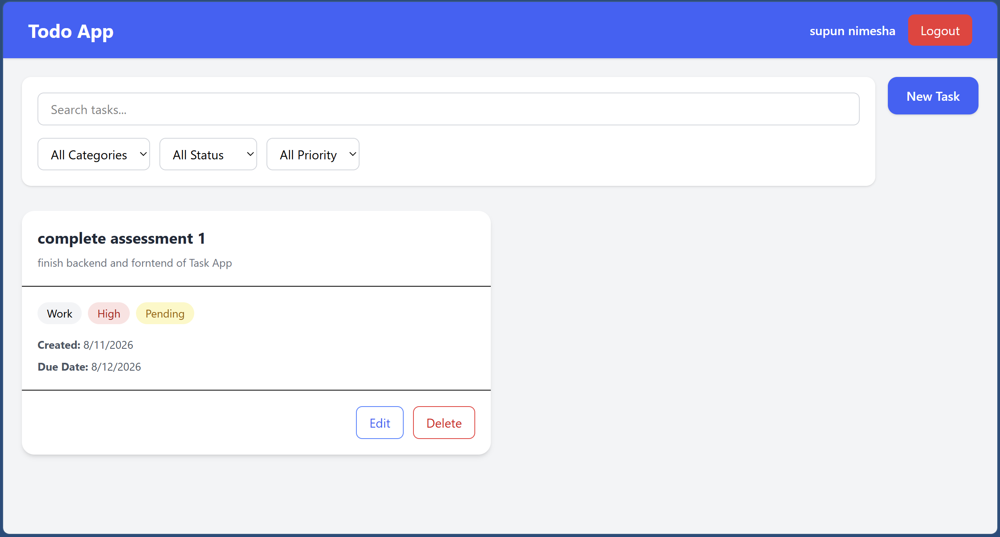
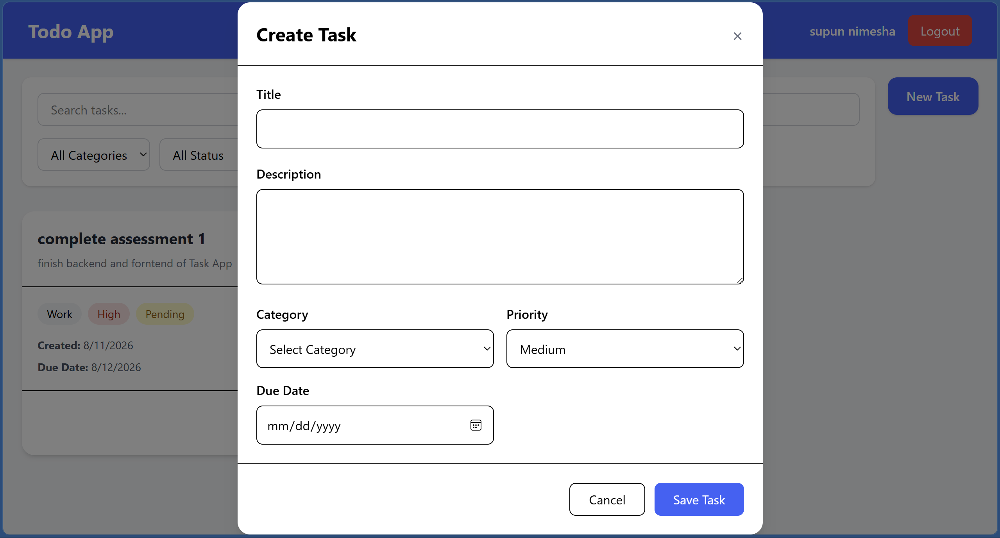

# ToDo Application

A full-stack ToDo application developed using React and ASP.NET Core Web API. The application allows authenticated users to create, view, update, delete, search, filter, and manage their tasks.

## Features

* User authentication using Auth0
* Secure access to protected API endpoints using JWT access tokens
* Create tasks
* View tasks
* Update tasks
* Delete tasks
* Mark tasks with different statuses
* Assign tasks to categories
* Set task priority
* Set task due dates
* Search tasks by title
* Filter tasks by category, status, and priority
* Dashboard for viewing and managing tasks
* Form validation
* Success and error notifications
* Responsive user interface

## Technology Stack

### Frontend

* React
* TypeScript
* Axios
* Tailwind CSS
* React Toastify
* Auth0 React SDK

### Backend

* ASP.NET Core Web API
* C#
* Entity Framework Core
* Clean Architecture
* JWT Bearer Authentication

### Database

* PostgreSQL

### Development Tools

* Visual Studio
* Visual Studio Code
* Git
* GitHub
* Postman
* draw.io / diagrams.net

## System Architecture

The application follows a separation between the frontend, backend, authentication provider, and database.

## Authentication

Auth0 is used as the third-party authentication provider.

The React application obtains an Auth0 access token and sends it with requests to protected API endpoints using the `Authorization` header.

## Project Structure

### Frontend
src/
├── components/
├── pages/
├── services/
├── model/
├── api/
├── App.tsx
└── main.tsx

The backend follows Clean Architecture principles with separation of responsibilities between the API, application/business logic, domain, and infrastructure/database layers.

Backend/
├── API
├── Application
├── Domain
└── Infrastructure

## Screenshots

### Login

### Dashboard

### Create / Edit Task

## Environment Variables

The frontend uses environment variables for Auth0 configuration.

VITE_AUTH0_DOMAIN=your-auth0-domain
VITE_AUTH0_CLIENT_ID=your-auth0-client-id
VITE_AUTH0_AUDIENCE=your-api-audience

## Installation and Setup

### Prerequisites

Make sure the following are installed:

* Node.js
* .NET SDK
* PostgreSQL
* Git

### Frontend

Navigate to the frontend directory:
cd frontend
Install dependencies:
npm install
Configure the required environment variables in `.env`.

Start the development server:

npm run dev
### Backend

Navigate to the backend project:

cd backend
Restore dependencies:
dotnet restore
Build the application:
dotnet build
Run the API:
dotnet run
Configure the database connection and Auth0 settings according to the backend configuration.

## Database
The application uses PostgreSQL to store application data.
Main entities include:

* User
* Task
* Category

The Entity Framework Core layer is responsible for communication between the ASP.NET Core application and PostgreSQL.

## Testing

The application includes testing for important application functionality.

Testing areas include:

* Authentication
* Task creation
* Task retrieval
* Task update
* Task deletion
* Validation
* API functionality

## Future Improvements

Possible future improvements include:

* Task reminders and notifications
* More advanced task sorting
* User profile management
* Additional dashboard statistics
* Improved automated test coverage
* Deployment to a cloud environment

## Author

**Supun Nimesha**

Software Engineer - Trainee

## License

This project was developed as part of a software engineering assessment.
